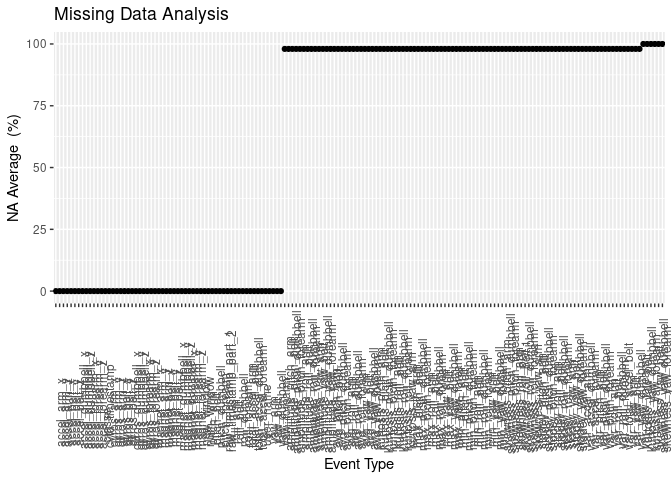
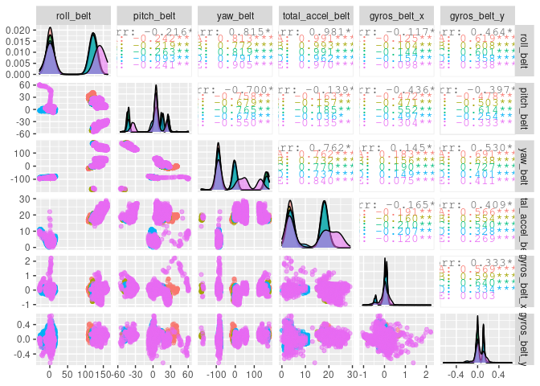
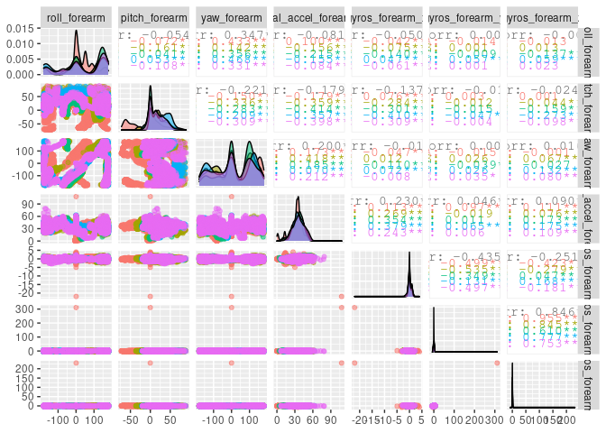
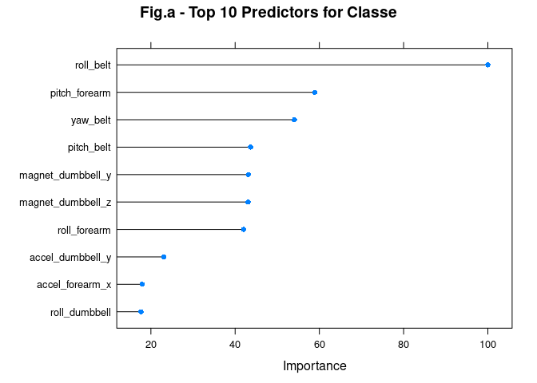

 [view mycode](https://github.com/ranalytica/QuantifiedSelfMovement){target="_blank"} 

 [view website](https://rpubs.com/Ranalytica/MotorTrend)


## Background

Using devices such as Jawbone Up, Nike FuelBand, and Fitbit it is now possible to collect a large amount of data about personal activity relatively inexpensively. These type of devices are part of the quantified self movement – a group of enthusiasts who take measurements about themselves regularly to improve their health, to find patterns in their behavior, or because they are tech geeks. One thing that people regularly do is quantify how much of a particular activity they do, but they rarely quantify how well they do it. In this project, your goal will be to use data from accelerometers on the **belt, forearm, arm, and dumbell** of 6 participants. They were asked to perform barbell lifts correctly and incorrectly in 5 different ways. More information is available from the website here: http://web.archive.org/web/20161224072740/http:/groupware.les.inf.puc-rio.br/har (see the section on the Weight Lifting Exercise Dataset).

## Data

The training data for this project are available here:

https://d396qusza40orc.cloudfront.net/predmachlearn/pml-training.csv

The test data are available here:

https://d396qusza40orc.cloudfront.net/predmachlearn/pml-testing.csv

The data for this project come from this source: http://web.archive.org/web/20161224072740/http:/groupware.les.inf.puc-rio.br/har. If you use the document you create for this class for any purpose please cite them as they have been very generous in allowing their data to be used for this kind of assignment.

## Environment


```r
library(caret)
library(mlbench)
library(tidyverse)
library(doParallel)
library(GGally)
sessionInfo()
```

```
## R version 4.0.1 (2020-06-06)
## Platform: x86_64-pc-linux-gnu (64-bit)
## Running under: Ubuntu 20.04 LTS
## 
## Matrix products: default
## BLAS:   /usr/lib/x86_64-linux-gnu/openblas-pthread/libblas.so.3
## LAPACK: /usr/lib/x86_64-linux-gnu/openblas-pthread/liblapack.so.3
## 
## locale:
##  [1] LC_CTYPE=en_US.UTF-8       LC_NUMERIC=C              
##  [3] LC_TIME=en_US.UTF-8        LC_COLLATE=en_US.UTF-8    
##  [5] LC_MONETARY=en_US.UTF-8    LC_MESSAGES=en_US.UTF-8   
##  [7] LC_PAPER=en_US.UTF-8       LC_NAME=C                 
##  [9] LC_ADDRESS=C               LC_TELEPHONE=C            
## [11] LC_MEASUREMENT=en_US.UTF-8 LC_IDENTIFICATION=C       
## 
## attached base packages:
## [1] parallel  stats     graphics  grDevices utils     datasets  methods  
## [8] base     
## 
## other attached packages:
##  [1] GGally_2.0.0      doParallel_1.0.15 iterators_1.0.12  foreach_1.5.0    
##  [5] forcats_0.5.0     stringr_1.4.0     dplyr_1.0.0       purrr_0.3.4      
##  [9] readr_1.3.1       tidyr_1.1.0       tibble_3.0.1      tidyverse_1.3.0  
## [13] mlbench_2.1-1     caret_6.0-86      ggplot2_3.3.1     lattice_0.20-41  
## 
## loaded via a namespace (and not attached):
##  [1] httr_1.4.1           jsonlite_1.6.1       splines_4.0.1       
##  [4] prodlim_2019.11.13   modelr_0.1.8         assertthat_0.2.1    
##  [7] stats4_4.0.1         blob_1.2.1           cellranger_1.1.0    
## [10] yaml_2.2.1           ipred_0.9-9          pillar_1.4.4        
## [13] backports_1.1.7      glue_1.4.1           pROC_1.16.2         
## [16] digest_0.6.25        RColorBrewer_1.1-2   rvest_0.3.5         
## [19] colorspace_1.4-1     recipes_0.1.12       htmltools_0.4.0     
## [22] Matrix_1.2-18        plyr_1.8.6           timeDate_3043.102   
## [25] pkgconfig_2.0.3      broom_0.5.6          haven_2.3.1         
## [28] scales_1.1.1         gower_0.2.1          lava_1.6.7          
## [31] generics_0.0.2       ellipsis_0.3.1       withr_2.2.0         
## [34] nnet_7.3-14          cli_2.0.2            survival_3.1-12     
## [37] magrittr_1.5         crayon_1.3.4         readxl_1.3.1        
## [40] evaluate_0.14        fs_1.4.1             fansi_0.4.1         
## [43] nlme_3.1-147         MASS_7.3-51.6        xml2_1.3.2          
## [46] class_7.3-17         tools_4.0.1          data.table_1.12.8   
## [49] hms_0.5.3            lifecycle_0.2.0      munsell_0.5.0       
## [52] reprex_0.3.0         compiler_4.0.1       rlang_0.4.6         
## [55] grid_4.0.1           rstudioapi_0.11      rmarkdown_2.2       
## [58] gtable_0.3.0         ModelMetrics_1.2.2.2 codetools_0.2-16    
## [61] reshape_0.8.8        DBI_1.1.0            reshape2_1.4.4      
## [64] R6_2.4.1             lubridate_1.7.9      knitr_1.28          
## [67] stringi_1.4.6        Rcpp_1.0.4.6         vctrs_0.3.1         
## [70] rpart_4.1-15         dbplyr_1.4.4         tidyselect_1.1.0    
## [73] xfun_0.14
```

### Load Data


```r
if (!file.exists("data")) {
        dir.create("data")
}

download.file("https://d396qusza40orc.cloudfront.net/predmachlearn/pml-training.csv", 
              destfile = "./data/pml-training.csv")

download.file("https://d396qusza40orc.cloudfront.net/predmachlearn/pml-testing.csv", 
              destfile = "./data/pml-testing.csv")

train_data <-read.csv(
                "./data/pml-training.csv",
                header = TRUE,
                na.strings = c(""," ", "NA","#DIV/0!"))

testing_data <- read.csv(
                "./data/pml-testing.csv",
                header = TRUE,
                na.strings = c(""," ", "NA", "#DIV/0!"))
```


## Missing Values Analysis


```r
naAnalysis <- train_data %>%
    purrr::map_df(function(x) round(mean(is.na(x)),digits = 2)*100) %>%
    gather(EVType, naAverage)

naAnalysis %>% ggplot(aes(x = EVType, y = naAverage)) %>% +
  geom_point(aes(reorder(EVType, naAverage))) + theme(axis.text.x =
              element_text(angle = 90, hjust = .1)) + labs(x = "Event Type", 
              y = "NA Average  (%)", title = "Missing Data Analysis")
```

<!-- -->

There are more than 50% of variables with greater than 98% missing values.  We will proceed in removing them in out analysis. 

```r
list_NA <-naAnalysis %>% filter(naAverage >0)
# data frame showing our variables with missing values

training_set <- train_data %>% select(-list_NA$EVType)
# removing variables with missing values
train_set <- training_set %>% select(-c(1:7))
dim(train_set)
```

```
## [1] 19622    53
```

## Visualization

The data are group in 4 separated in 13 variables. See below:


```r
belt<-names(train_set)[1:13]
"arm"<-names(train_set)[14:26]
dumbbell<-names(train_set)[27:39]
forearm<-names(train_set)[40:52]
data.frame(belt, arm, dumbbell, forearm)
```

```
##                belt             arm             dumbbell             forearm
## 1         roll_belt        roll_arm        roll_dumbbell        roll_forearm
## 2        pitch_belt       pitch_arm       pitch_dumbbell       pitch_forearm
## 3          yaw_belt         yaw_arm         yaw_dumbbell         yaw_forearm
## 4  total_accel_belt total_accel_arm total_accel_dumbbell total_accel_forearm
## 5      gyros_belt_x     gyros_arm_x     gyros_dumbbell_x     gyros_forearm_x
## 6      gyros_belt_y     gyros_arm_y     gyros_dumbbell_y     gyros_forearm_y
## 7      gyros_belt_z     gyros_arm_z     gyros_dumbbell_z     gyros_forearm_z
## 8      accel_belt_x     accel_arm_x     accel_dumbbell_x     accel_forearm_x
## 9      accel_belt_y     accel_arm_y     accel_dumbbell_y     accel_forearm_y
## 10     accel_belt_z     accel_arm_z     accel_dumbbell_z     accel_forearm_z
## 11    magnet_belt_x    magnet_arm_x    magnet_dumbbell_x    magnet_forearm_x
## 12    magnet_belt_y    magnet_arm_y    magnet_dumbbell_y    magnet_forearm_y
## 13    magnet_belt_z    magnet_arm_z    magnet_dumbbell_z    magnet_forearm_z
```

We can visualize the correlation using ggpairs using GGally package as follows:

```r
cl <- makePSOCKcluster(5)
registerDoParallel(cl)

ggpairs(data = train_set, columns = 1:6, ggplot2::aes(colour = classe, alpha=.3))
```

<!-- -->

```r
# change columns numbers to see remaining correlation pair plot 
# i.e. columns = 7:13
stopCluster(cl)
```

Variables 40:46


```r
cl <- makePSOCKcluster(5)
registerDoParallel(cl)

ggpairs(data = train_set, columns = 40:46, ggplot2::aes(colour = classe, alpha=.3))
```

<!-- -->

```r
# change columns numbers to see remaining correlation pair plot 
# i.e. columns = 6:10
stopCluster(cl)
```

## Slice Data

We will use createDataPartition function from the caret package to split the data 75/25, training and test respectively.


```r
set.seed(420)
final_set <- createDataPartition(train_set$classe, p=.75, list= FALSE)

training_ls <-train_set[final_set,]

testing_ls <- train_set[-final_set,]

dim(training_ls)
```

```
## [1] 14718    53
```

```r
dim(testing_ls)
```

```
## [1] 4904   53
```

## Modeling.

We will use Random Forest and Naive bayes to construct our model.  We will not add any traincontrol in our model and simply accept the default values. We will also use doparallel package to use all cpu cores to speed up the process.  I've been researching gpu access without any luck. gputools and gpuR seem to have been archieved and cannot use it on r 4.0 version.  

## Random Forest (rf) Model


```r
set.seed(420)
cl <- makePSOCKcluster(5)
registerDoParallel(cl)

modelfit <- train(data=training_ls, classe~., method="rf")

stopCluster(cl)
```

## Top 10 Predictors (random forest)


```r
g1<- plot(varImp(modelfit), top = 10, main = "Fig.a - Top 10 Predictors for Classe")
g1
```

<!-- -->

## Prediction and Confusion Matrix


```r
final_prediction <- predict(modelfit, newdata = testing_ls)
testing_ls$classe<-as.factor(testing_ls$classe)
confusionMatrix(final_prediction, testing_ls$classe)
```

```
## Confusion Matrix and Statistics
## 
##           Reference
## Prediction    A    B    C    D    E
##          A 1395    7    0    0    0
##          B    0  939    6    0    0
##          C    0    3  845   11    0
##          D    0    0    4  792    0
##          E    0    0    0    1  901
## 
## Overall Statistics
##                                           
##                Accuracy : 0.9935          
##                  95% CI : (0.9908, 0.9955)
##     No Information Rate : 0.2845          
##     P-Value [Acc > NIR] : < 2.2e-16       
##                                           
##                   Kappa : 0.9917          
##                                           
##  Mcnemar's Test P-Value : NA              
## 
## Statistics by Class:
## 
##                      Class: A Class: B Class: C Class: D Class: E
## Sensitivity            1.0000   0.9895   0.9883   0.9851   1.0000
## Specificity            0.9980   0.9985   0.9965   0.9990   0.9998
## Pos Pred Value         0.9950   0.9937   0.9837   0.9950   0.9989
## Neg Pred Value         1.0000   0.9975   0.9975   0.9971   1.0000
## Prevalence             0.2845   0.1935   0.1743   0.1639   0.1837
## Detection Rate         0.2845   0.1915   0.1723   0.1615   0.1837
## Detection Prevalence   0.2859   0.1927   0.1752   0.1623   0.1839
## Balanced Accuracy      0.9990   0.9940   0.9924   0.9920   0.9999
```

## Naive Bayes Model


```r
set.seed(420)
cl <- makePSOCKcluster(5)
registerDoParallel(cl)

modelfit_nb <- train(data=training_ls, classe~., method="nb")

stopCluster(cl)
```


```r
set.seed(420)

prediction_nb <- predict(modelfit_nb, newdata = testing_ls)
table(final_prediction, prediction_nb)
```

```
##                 prediction_nb
## final_prediction    A    B    C    D    E
##                A 1239   26   39   91    7
##                B  184  641   63   45   12
##                C  217   48  549   42    3
##                D  149    4   96  496   51
##                E   52   78   33   31  708
```

```r
confusionMatrix(prediction_nb, testing_ls$classe)
```

```
## Confusion Matrix and Statistics
## 
##           Reference
## Prediction    A    B    C    D    E
##          A 1233  192  214  150   52
##          B   26  639   50    4   78
##          C   38   63  548   98   33
##          D   91   43   40  501   30
##          E    7   12    3   51  708
## 
## Overall Statistics
##                                           
##                Accuracy : 0.74            
##                  95% CI : (0.7275, 0.7522)
##     No Information Rate : 0.2845          
##     P-Value [Acc > NIR] : < 2.2e-16       
##                                           
##                   Kappa : 0.6672          
##                                           
##  Mcnemar's Test P-Value : < 2.2e-16       
## 
## Statistics by Class:
## 
##                      Class: A Class: B Class: C Class: D Class: E
## Sensitivity            0.8839   0.6733   0.6409   0.6231   0.7858
## Specificity            0.8267   0.9601   0.9427   0.9502   0.9818
## Pos Pred Value         0.6697   0.8018   0.7026   0.7106   0.9065
## Neg Pred Value         0.9471   0.9245   0.9256   0.9278   0.9532
## Prevalence             0.2845   0.1935   0.1743   0.1639   0.1837
## Detection Rate         0.2514   0.1303   0.1117   0.1022   0.1444
## Detection Prevalence   0.3754   0.1625   0.1591   0.1438   0.1593
## Balanced Accuracy      0.8553   0.8167   0.7918   0.7867   0.8838
```

The accuracy of our nb is .74 vs. rf at .99.  We will run both predictions on our testing_data we downloaded from the web and compare.  We do not have the variable classe in our testing_data.  

## Final Answer

modelfit which uses random forest "rf" model has a better fit compared with naives bayes "nb".  

```r
Done_rf <- (predict(modelfit, newdata = testing_data))
Done_nb <- (predict(modelfit_nb, newdata = testing_data))
```

## Random Forest results


```r
Done_rf
```

```
##  [1] B A B A A E D B A A B C B A E E A B B B
## Levels: A B C D E
```

```r
table(Done_rf)
```

```
## Done_rf
## A B C D E 
## 7 8 1 1 3
```

## Naive Bayes results


```r
Done_nb
```

```
##  [1] A A A A A E D C A A A A B A E B A B A B
## Levels: A B C D E
```

```r
table(Done_nb)
```

```
## Done_nb
##  A  B  C  D  E 
## 12  4  1  1  2
```

## RF vs. NB comparison


```r
table(Done_rf, Done_nb)
```

```
##        Done_nb
## Done_rf A B C D E
##       A 7 0 0 0 0
##       B 4 3 1 0 0
##       C 1 0 0 0 0
##       D 0 0 0 1 0
##       E 0 1 0 0 2
```


